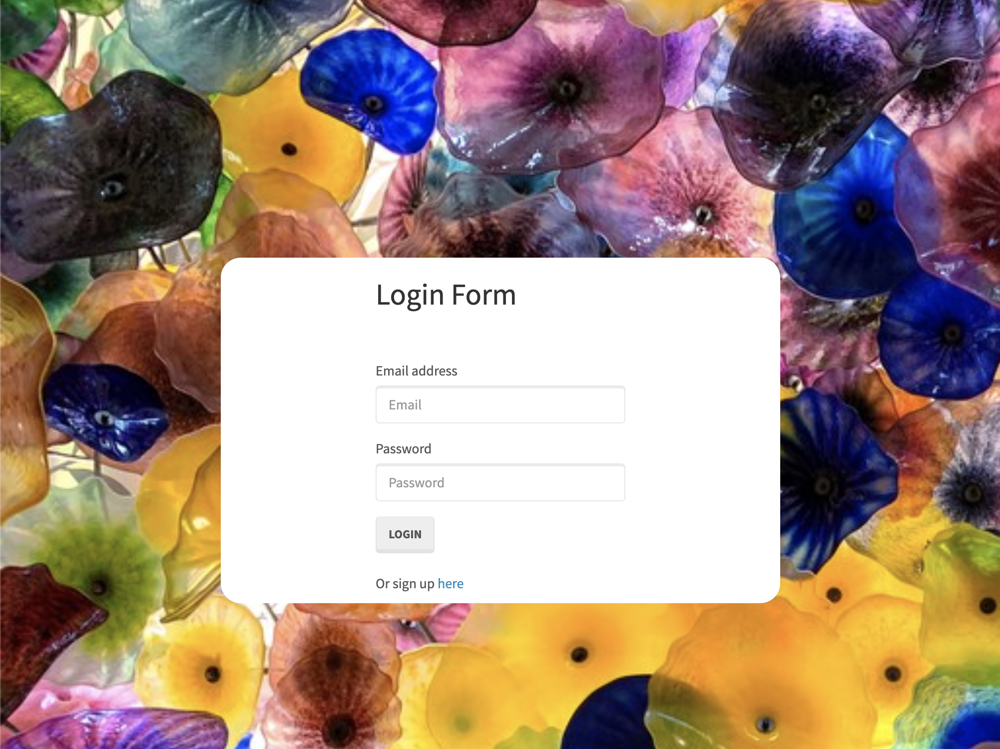
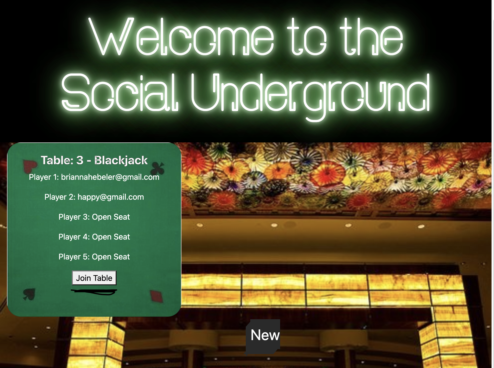
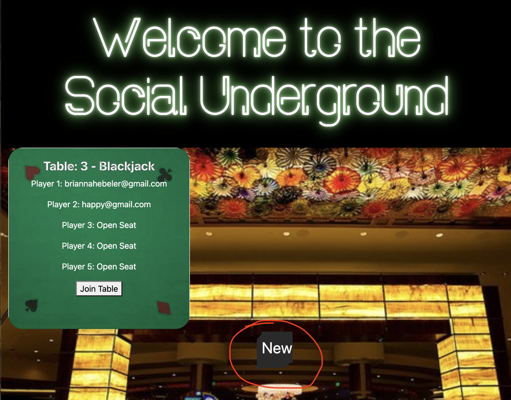
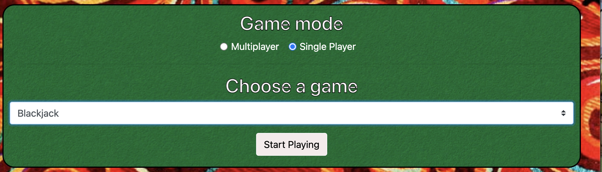
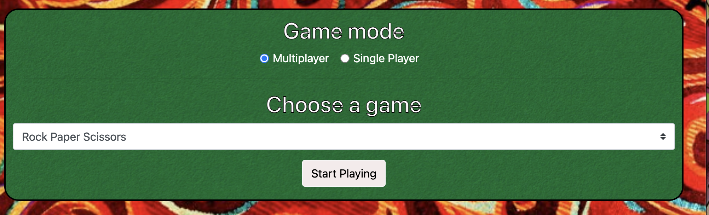

# social-underground 

## Team Members
- Ryan Zelazny
- Brianna Hebeler
- Alexander (Zander) Portera
- Justin Rhee
- Yasmim Sampaio

## Introduction
For project 2 we wanted the user to be able to hangout with their friends while playing a game. We also built a platform where people do not need multiple windows open to play a game and chat. We made a settled for a fun game of blackjack and rock paper scissor. 

## How to use

1) If you're a new player click sign up, if not just login

2) You can either join a table or make a new table

3) If you join a table just read the direction and click start

4) If you start a new game you must choose a game a play. We also have a smiple game of rock, paper, or scissor. 

5) Lastly we have a chat box at the bottom on the page so you can talk with your friends. 

6) Have fun!

## Link
Heroku:
https://social-underground-bc.herokuapp.com/

Github:
https://github.com/rzelazny/social-underground 
