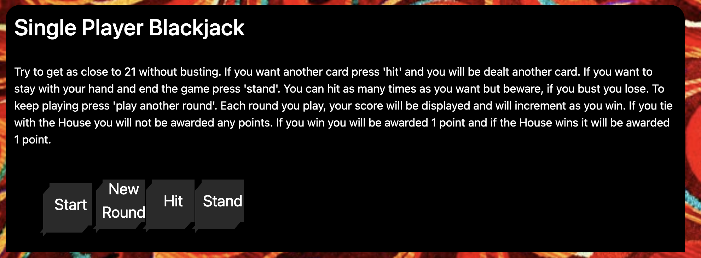

# Social Underground 

## Team Members
- Ryan Zelazny
- Brianna Hebeler
- Alexander (Zander) Portera
- Justin Rhee
- Yasmim Sampaio

## Description
Welcome to the Social Underground, a place where you can meet with friends and play some games in a virtual casino. This is an application built so that users do not need multiple windows open to play a game and chat. The user will be able to be able to hangout with their friends while playing a fun game of blackjack or rock paper scissors at one of our "tables".

## How to use

1) If you're a new player click sign up, if not just login using the information provided when you signed up

2) You can either join an existing table or make a new table

3) If you join an existing table just read the directions and click start on the game

4) If you start at a new table you must choose a game a play. We have created a fun version of  rock, paper, or scissors where you and another player can send snapshots back and forth using our integrated webcam.

5) Lastly we have a chat box at the bottom of each table so you can talk with your friends. 

6) Have fun!

## Link
Heroku:
https://social-underground-bc.herokuapp.com/

Github:
https://github.com/rzelazny/social-underground 
